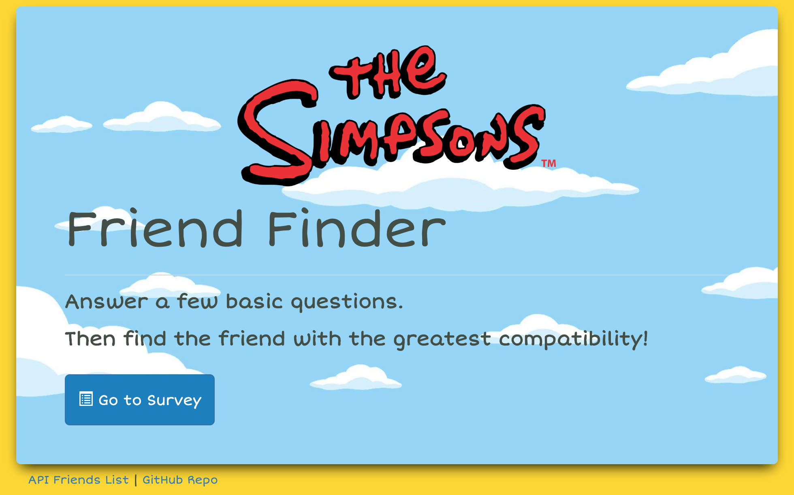

# Friend Finder 
https://simpsons-friend-finder.herokuapp.com/  
- - -

## Overview

In this activity, I built a compatibility-based "FriendFinder" application -- basically a dating app. This full-stack site will take in results from users' surveys, then compare their answers with those from other users. The app will then display the name and picture of the user with the best overall match.  I gave my app a "Simpsons" theme.  


- - -

## Function

- The survey has 10 questions of my choosing. Each answer is on a scale of 1 to 5 based on how much the user agrees or disagrees with a question.

- The `server.js` file requires the basic npm packagess: `express` and `path`.

- The `htmlRoutes.js` file includes two routes:

   * A GET Route to `/survey` which displays the survey page.
   * A default, catch-all route that leads to `home.html` which displays the home page.

- The `apiRoutes.js` file contains two routes:

   * A GET route with the url `/api/friends`. This is used to display a JSON of all possible friends.
   * A POST route `/api/friends`. This is used to handle incoming survey results. This route is also used to handle the compatibility logic.

- Application data is saved inside of `app/data/friends.js` as an array of objects. Each of these objects follows the format below.

```json
{
  "name": "Homer Simpson",
  "photo": "https://upload.wikimedia.org/wikipedia/en/0/02/Homer_Simpson_2006.png",
  "scores":[
      5,
      1,
      4,
      4,
      5,
      1,
      2,
      5,
      4,
      1
    ]
}
```

- The user's most compatible friend is determined by the following:

   * Each user's results are converted into a simple array of numbers (ex: `[5, 1, 4, 4, 5, 1, 2, 5, 4, 1]`).
   * With that done, the difference is compared between the current user's scores and those from other users, question by question. 
   * The closest match is the user with the least amount of difference.

- Once the current user's most compatible friend is determined, the results are displayed as a modal pop-up.
   * The modal displays both the name and picture of the closest match.


## Setup

### Installation
To install the application, enter the following command line commands:
```
git clone https://github.com/matthewemichael/FriendFinder.git
cd FriendFinder
npm install
```

### Run Application Locally
At the command line enter:
```
node server.js
```
- You should receive a message `App listening on PORT: 8080` in the terminal window.  
- The port number can be changed in the `server.js` file if necessary.  

The application can now be accessed in a web browser at:
```
localhost:8080
```


- - -

## Technologies Used

* [Bootstrap](https://getbootstrap.com/)
* [JavaScript](https://www.javascript.com)
* [JQuery](https://jquery.com/)
* [Node.Js](https://nodejs.org/en/)
* Node Packages
  * [Express](https://www.npmjs.com/package/express)
  * [Path](https://www.npmjs.com/package/path)
